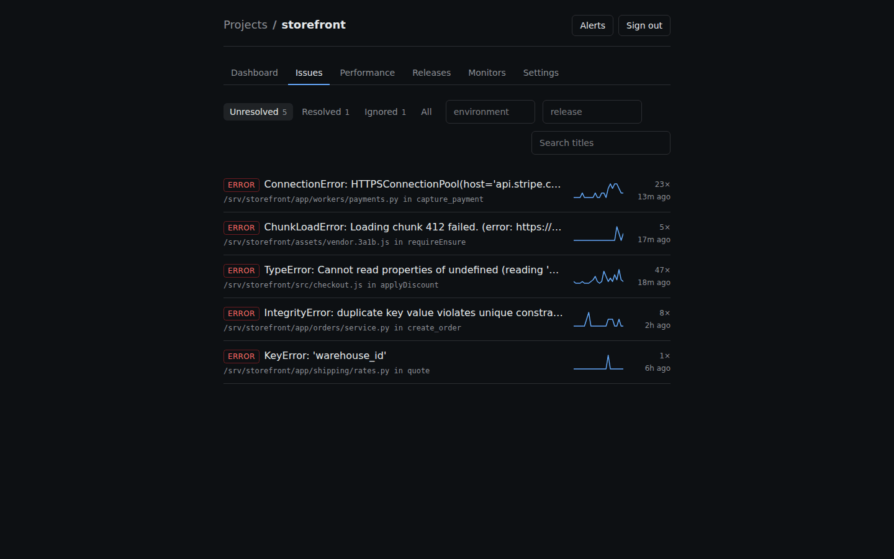
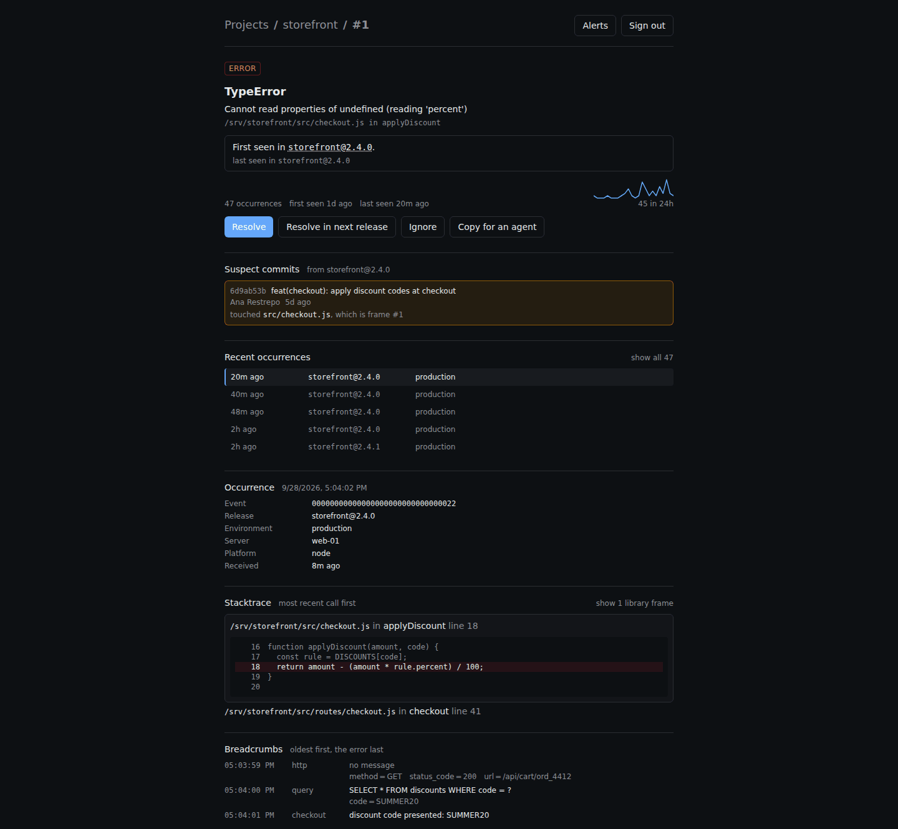
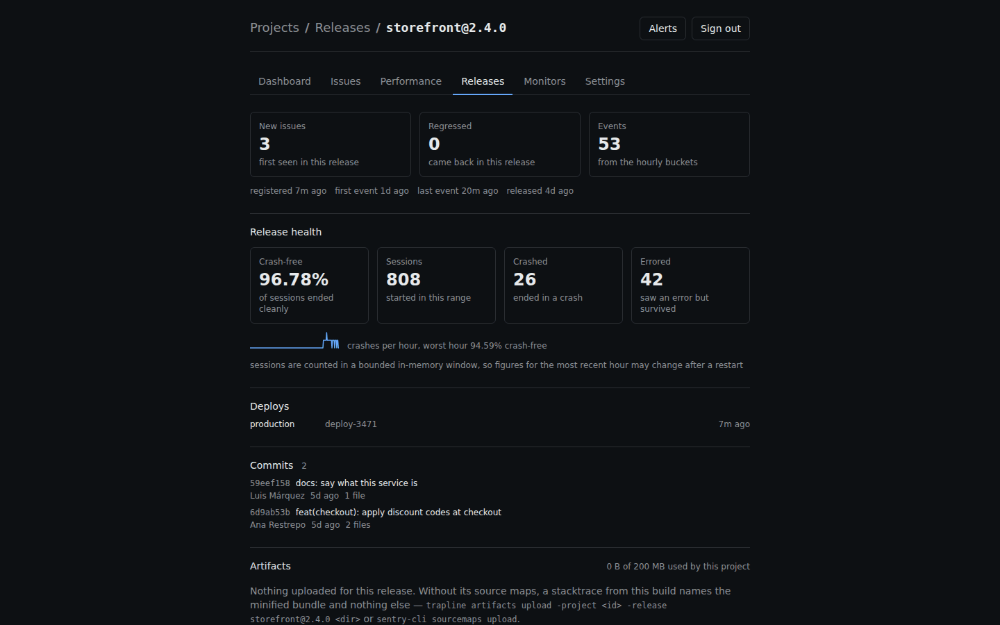
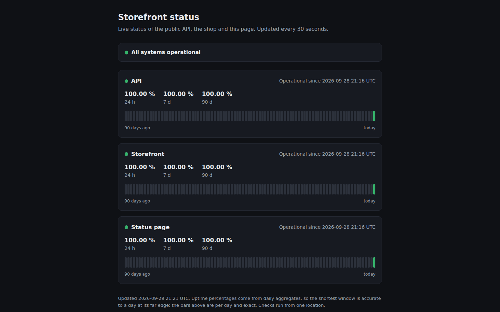

# trapline

[](https://github.com/antoniojosev/trapline/actions/workflows/ci.yml)
[](https://github.com/antoniojosev/trapline/releases)
[](LICENSE)
[](go.mod)

**Error tracking, tracing, uptime, cron monitoring and a status page in one
binary**, compatible with the official Sentry SDKs: change the DSN and it
works.

One process. One state file. **19.7 MB of RAM** idle on a fresh install,
**34.2 MB** with absolutely everything switched on.

```sh
trapline serve -db ./data.db -origin https://errors.example.com
```

That is the whole installation.

## Screenshots










---

## The numbers, and where they come from

None of these is an estimate. `scripts/footprint.sh` measures them; it is the
executable half of [docs/benchmarks/footprint.md](docs/benchmarks/footprint.md),
and a nightly gate measures them again and fails if they stop being true.

| | minimal profile | everything on |
|---|---|---|
| RAM, idle | **19.7 MB** | **34.2 MB** |
| RAM, peak while ingesting | n/a | **38.7 MB** |
| RAM, peak while being read | n/a | **38.0 MB** |
| background jobs | 1 | 6 |

- **Binary: 18.13 MB**, against a 30 MB budget that breaks the build.
- **Disk: 86.1 MB for 130,000 items**: 695 bytes per item, with the compressed
  payload, the indexes, the search index, the hourly buckets and the latency
  sketches included.
- **Ingest: 611 to 628 events/s** median in `make bench`, against a gate
  threshold of 150.

"Everything on" means everything at once: errors with their aggregates and
their FTS5 index, source maps uploaded through the real path, tracing at
100 %, release health with real sessions, one alert channel with its encrypted
secret, ten monitors split between cron and uptime, the status page and the
weekly digest. The gate checks that all six jobs are running, because a
subsystem that never started would make the number look better than it is,
which is the direction a benchmark lies in when nobody is watching.

Measured on one machine (WSL2, Linux 6.6, Go 1.26.6). **A number from one
machine is an anecdote.** What makes it mean something is that the gate
measures it again every night.

## Compatible with the SDKs you already use

Change the DSN. Nothing else.

```diff
-dsn="https://abc123@o123456.ingest.sentry.io/4505..."
+dsn="https://<public_key>@errors.example.com/1"
```

| SDK | Package | Tested version | Tier |
|---|---|---|---|
| Go | `github.com/getsentry/sentry-go` | 0.48.0 | every PR |
| Python | `sentry-sdk` | 2.68.1 | every PR |
| Node | `@sentry/node` | 10.71.0 | every PR |
| Browser | `@sentry/browser` | 10.71.0 | nightly |
| PHP | `sentry/sentry` | 4.16.0 | nightly |
| Dart | `sentry` | 9.7.0 | nightly |

That table is not written from memory: each row is a suite that sends real
errors, with the official SDK at the pinned version, to a real server, and
checks what arrived and how it was grouped
([compat/README.md](compat/README.md)). A hand-written envelope would only test
this project's idea of what an SDK sends, which is exactly the thing in
question.

**And `sentry-cli` too**: `releases new`, `set-commits --local`, `finalize`,
`deploys new` and `sourcemaps upload` work with `SENTRY_URL` pointed here. The
deploy pipeline stays untouched. That surface was implemented **by recording
the real tool's traffic**, not by reading its documentation
([ADR 013](docs/adr/0013-compatibilidad-con-sentry-cli-a-partir-de-trafico-grabado.md)).

## What it does

- **Errors**, grouped, with the grouping algorithm versioned.
- **Releases**: which deploy introduced the error, which commit touched it, and
  "resolved in the next release" with the rule that does **not** reopen the
  issue for the pods you have not redeployed yet.
- **Source maps**: debug ids first, `release`+URL second, resolved at ingest
  and not at read time.
- **Tracing**: transactions, waterfall, p50/p95/p99, computed at query time and
  never pre-stored.
- **Release health**: crash-free per release, without storing a row per session.
- **Cron monitors**: SDK check-ins, and a `curl` to a URL for everything else.
- **Uptime monitors** with an SSRF guard, and a **public status page** rendered
  on the server.
- **Alerts** to Telegram, Slack, Discord, signed webhook and email, through a
  persistent outbox: a restart neither loses nor duplicates.
- **Web panel** embedded in the binary, and a **first-class CLI**: `--json`
  everywhere, zero prompts, stable exit codes.

## Agent-first, and this is the argument

The error arrives, your agent reads it, patches the code, runs the tests and
marks it resolved for the next release. Without leaving your machine.

```sh test
trapline issues bundle -project 1 -issue 1
```

That returns **one markdown document**: the exception, the symbolicated
stacktrace with code context, the breadcrumbs, the aggregated tags, the 24 h
and 14 d frequency, and the suspect commits with the reason they are suspect.
One call, instead of five round trips where the shape of the JSON has to be
worked out again each time.

The same over **MCP**, embedded in the binary: `trapline mcp` over stdio for
the agent on your laptop, `POST /mcp` for the one running somewhere else. Ten
tools that are, literally, calls to `/api/v1/` with **your** token, so a tool
cannot do more than the credential you called it with
([ADR 022](docs/adr/0022-mcp-como-cuarto-cliente.md)).

And a ready-to-use skill: [`/fix-error`](skills/fix-error/SKILL.md), which
reads the bundle, locates the code, writes the failing test, patches, runs your
suite and closes the issue. **It never pushes and never deploys.**

A cloud service cannot give this away without cannibalizing itself. One that
runs on your machine can.

## Getting started

```sh
./scripts/bootstrap.sh   # prepares the working copy; idempotent
make check               # exactly what CI runs on a PR
```

- **Install it** → [docs/install.md](docs/install.md)
- **Run it in production** (systemd, Docker, proxy, backup) → [deploy/README.md](deploy/README.md)
- **Coming from Sentry** → [docs/migrate-from-sentry.md](docs/migrate-from-sentry.md)
- **Operate it with an agent** → [docs/agents/operating.md](docs/agents/operating.md)
- **Why it is built this way** → [ARCHITECTURE.md](ARCHITECTURE.md) and
  [docs/architecture/README.md](docs/architecture/README.md)

Design records (ADRs) and internal docs are in Spanish: everything under
`docs/adr/`, `docs/architecture/`, `docs/benchmarks/`, `docs/agents/` and
`docs/alerts/`.

## Compared with running Sentry self-hosted

The honest comparison is not one measurement against another: **we have not
stood up their stack to measure it**, and claiming otherwise would be making it
up. What can be compared is what each project tells you to provision, which is
the decision you make before installing anything.

| | this | `sentry` self-hosted |
|---|---|---|
| what you have to provision | 1 core, 512 MB of RAM | **4 cores, 16 GB of RAM, 20 GB of disk** (declared minimum in their repo) |
| what gets deployed | one static binary | ~40 containers via `docker compose` |
| what else is needed | nothing | Kafka, ZooKeeper, ClickHouse, PostgreSQL, Redis, Memcached, Snuba, Relay, Symbolicator |
| upgrading | replace the binary | `install.sh` with migrations across several services |
| backup | copy one file | pg_dump + ClickHouse + the volumes |

With its asterisks, which matter as much as the table:

- **Those 16 GB are their *published* minimum, not our measurement.** A
  published minimum is conservative by design. It has also changed more than
  once (it was 8 GB before it was 16), so it is quoted as it stood in September
  2026: **if you are going to repeat it, check it again**.
- **They do not do the same thing.** That stack processes the volume of
  thousands of organizations, stores every session individually and has an
  entire event search engine that does not exist here and will not.
- **The comparison is for a small installation.** At large-enterprise scale,
  the right-hand column has answers this one does not.

The full breakdown, with the methodology: [docs/benchmarks/footprint.md](docs/benchmarks/footprint.md#5-la-comparativa-con-sus-asteriscos).

## What it will NOT do, ever

Session replay, continuous profiling, native symbolication (iOS/Android/DWARF),
custom metrics, SSO/SAML, log management at scale, query builder,
multi-node/HA.

**The list is a contract, not a backlog.** Each line is one reason the
left-hand column of the table above is possible. What to do instead, line by
line, is in
[docs/migrate-from-sentry.md](docs/migrate-from-sentry.md#4-what-does-not-exist-and-is-not-a-to-do-list).

## Status

**Pre-1.0. v0.1.0 is on the way.** Everything above exists, has its gate and
runs in CI; what remains before the first public release is the signed
binaries and the Docker image.

`main` always compiles, passes the gates and is installable. The gates do not
get relaxed: if one turns red because of a legitimate change, that is a design
conversation, not a number to bump.

## License

**AGPL-3.0** (see [LICENSE](LICENSE)). The event engine, once extracted as a
library, will be **Apache-2.0**: it is code meant to be reused.

Normal use carries no obligations: installing it and looking at your own errors
does not oblige you to anything. The AGPL only applies if you **distribute** or
**offer as a network service** a modified version.

On why AGPL and not something more restrictive, and the commitment that this
does not change: [CONTRIBUTING.md](CONTRIBUTING.md#license-commitment).

---

Not affiliated with Sentry. "Sentry" is a registered trademark of Functional
Software, Inc.; it is mentioned here nominatively to describe protocol
compatibility.
